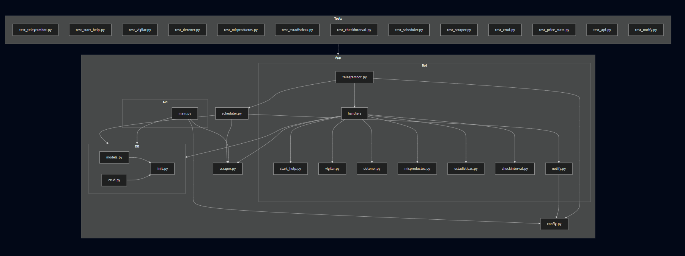

# Arquitectura del sistema

## Estructura general del proyecto
```console
Baywatchers
│   .coverage
│   .dockerignore
│   .env
│   .gitignore
│   baywatchers.py
│   docker-compose.yml
│   Dockerfile
│   generar-diagramas.bat
│   LICENSE
│   plantuml-1.2025.2.jar
│   poetry.lock
│   prueba.py
│   pyproject.toml
│   README.md
│   requirements.txt
│
├───.vscode
│       settings.json
│
├───app
│   │   config.py
│   │   scheduler.py
│   │   scraper.py
│   │   __init__.py
│   │
│   ├───api
│   │   │   main.py
│   │   │   main_UML.puml
│   │   │   __init__.py
│   │   │
│   │   └───diagrams
│   │           main_UML.png
│   │
│   ├───bot
│   │   │   notify.py
│   │   │   telegrambot.py
│   │   │   __init__.py
│   │   │
│   │   └───handlers
│   │           checkinterval.py
│   │           detener.py
│   │           estadisticas.py
│   │           misproductos.py
│   │           start_help.py
│   │           vigilar.py
│   │           __init__.py
│   │
│   └───db
│       │   crud.py
│       │   models.py
│       │   models_UML.puml
│       │   __init__.py
│       │
│       └───diagrams
│               models_UML.png
│
├───docs
│   │   api.md
│   │   arquitectura.md
│   │   instalacion.md
│   │   README.md
│   │   uml.md
│   │
│   └───img
├───swark-output
│       2025-06-01__23-43-19__diagram.md
│       2025-06-01__23-43-19__log.md
│
└───tests
        test_api.py
        test_checkinterval.py
        test_crud.py
        test_detener.py
        test_estadisticas.py
        test_misproductos.py
        test_notify.py
        test_price_stats.py
        test_scheduler.py
        test_scraper.py
        test_start_help.py
        test_telegrambot.py
        test_vigilar.py
        __init__.py

```


Esto es lo que puede verse con el código que se encuentra debajo, si se estuviese viendo en vscode con la extensión "mermaid".
```vscode
::: mermaid

graph TD
    subgraph App
        subgraph Bot
            TelegramBot[telegrambot.py]
            Notify[notify.py]
            Handlers[handlers]
            Handlers --> StartHelp[start_help.py]
            Handlers --> Vigilar[vigilar.py]
            Handlers --> Detener[detener.py]
            Handlers --> MisProductos[misproductos.py]
            Handlers --> Estadisticas[estadisticas.py]
            Handlers --> CheckInterval[checkinterval.py]
        end
        subgraph API
            MainAPI[main.py]
        end
        subgraph DB
            Models[models.py]
            CRUD[crud.py]
            DBInit[__init__.py]
        end
        Config[config.py]
        Scheduler[scheduler.py]
        Scraper[scraper.py]
    end

    subgraph Tests
        TestBot[test_telegrambot.py]
        TestStartHelp[test_start_help.py]
        TestVigilar[test_vigilar.py]
        TestDetener[test_detener.py]
        TestMisProductos[test_misproductos.py]
        TestEstadisticas[test_estadisticas.py]
        TestCheckInterval[test_checkinterval.py]
        TestScheduler[test_scheduler.py]
        TestScraper[test_scraper.py]
        TestCRUD[test_crud.py]
        TestPriceStats[test_price_stats.py]
        TestAPI[test_api.py]
        TestNotify[test_notify.py]
    end

    TelegramBot --> Scheduler
    TelegramBot --> Config
    TelegramBot --> Handlers
    Notify --> Config
    Handlers --> DB
    Handlers --> Scraper
    MainAPI --> DB
    MainAPI --> Scraper
    MainAPI --> Config
    Scheduler --> DB
    Scheduler --> Scraper
    Scheduler --> Notify
    Models --> DBInit
    CRUD --> DBInit
    Tests --> App
:::
```
:tm: :shipit: :recycle: :goberserk: