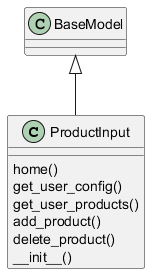
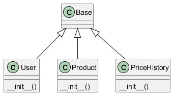

# Diagramas UML

Los diagramas se generaron automáticamente desde el código fuente usando PyUML + PlantUML.

## 📄 Diagrama de clases

 

::: mermaid

graph TD
    subgraph App
        subgraph Bot
            TelegramBot[telegrambot.py]
            Notify[notify.py]
            Handlers[handlers]
            Handlers --> StartHelp[start_help.py]
            Handlers --> Vigilar[vigilar.py]
            Handlers --> Detener[detener.py]
            Handlers --> MisProductos[misproductos.py]
            Handlers --> Estadisticas[estadisticas.py]
            Handlers --> CheckInterval[checkinterval.py]
        end
        subgraph API
            MainAPI[main.py]
        end
        subgraph DB
            Models[models.py]
            CRUD[crud.py]
            DBInit[__init__.py]
        end
        Config[config.py]
        Scheduler[scheduler.py]
        Scraper[scraper.py]
    end

    subgraph Tests
        TestBot[test_telegrambot.py]
        TestStartHelp[test_start_help.py]
        TestVigilar[test_vigilar.py]
        TestDetener[test_detener.py]
        TestMisProductos[test_misproductos.py]
        TestEstadisticas[test_estadisticas.py]
        TestCheckInterval[test_checkinterval.py]
        TestScheduler[test_scheduler.py]
        TestScraper[test_scraper.py]
        TestCRUD[test_crud.py]
        TestPriceStats[test_price_stats.py]
        TestAPI[test_api.py]
        TestNotify[test_notify.py]
    end

    TelegramBot --> Scheduler
    TelegramBot --> Config
    TelegramBot --> Handlers
    Notify --> Config
    Handlers --> DB
    Handlers --> Scraper
    MainAPI --> DB
    MainAPI --> Scraper
    MainAPI --> Config
    Scheduler --> DB
    Scheduler --> Scraper
    Scheduler --> Notify
    Models --> DBInit
    CRUD --> DBInit
    Tests --> App
:::
Estos diagramas representan las relaciones entre los modelos y servicios principales.

Muestra la organización modular del proyecto.

> Los archivos `.txt` generados se convierten en `.png` mediante PlantUML.

:tm: :shipit: :recycle: :goberserk: