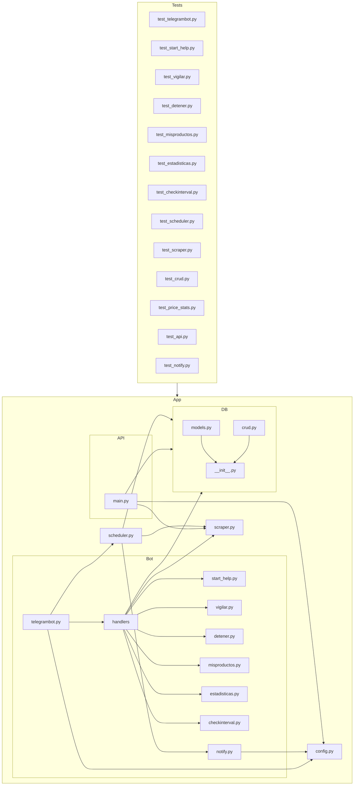

    

    <b>Automatic Architecture Diagrams from Code</b> 
    <a href="https://github.com/swark-io/swark">GitHub</a> • <a href="https://swark.io">Website</a> • <a href="mailto:contact@swark.io">Contact Us</a>

## Usage Instructions

1. **Render the Diagram**: Use the links below to open it in Mermaid Live Editor, or install the [Mermaid Support](https://marketplace.visualstudio.com/items?itemName=bierner.markdown-mermaid) extension.
2. **Recommended Model**: If available for you, use `claude-3.5-sonnet` [language model](vscode://settings/swark.languageModel). It can process more files and generates better diagrams.
3. **Iterate for Best Results**: Language models are non-deterministic. Generate the diagram multiple times and choose the best result.

## Generated Content
**Model**: GPT-4o - [Change Model](vscode://settings/swark.languageModel)  
**Mermaid Live Editor**: [View](https://mermaid.live/view#pako:eNqNVdtu4yAQ_RWL53Y_IA8rNfFKzUOraJPdF1xZ1ExiVBtbgCtFVf-9MODE-NLUL8PMOcNlOIw_SNFwICuSyZNibZkc0kwm9tPdqw88tK2PRNF1Y65R9x2gAgvVFqAmjF8b86s9v8TE58aI45lKNFP4kUlegdK0DIMFPLm__53sDVPmEaqWajfKSztcnhJT_ouTqJii797eYKdgQIKi3Nsb7Cehd6rhXWEaTWuh2965kffH7p4LbUTBNIWBcyNvU0LxtpUG1DuraOE8Ebw4EySfucOH3Tae_IkJaYO0tvYnE6TrUb6VUmVPjma6983ffyktVMenULreSmFongtr8vybxTeNPIoTLdDEvL2tAO9sdajuR2OC3TbCaK8grjDS_cFehL7mOtdrW5t8UeCOdRUlcpeU6ai9GJE4q0jH6kWIrFklOlYkPqQuK9DxI9Ehf1l5jh-LDRO-URwW4nIfvhDzl-KZ_mICb3Q7lx04_fiFJyJy-E6JAmz1TThP63xXfzNzHKdzZLFWTNHQpJAw7lQDsQyanu9H_RHnYa_deax_2B7160-S4t60ngmGSnokvOeIPYwtkodrXs4UTRNHo4liyJ8kLIGNIczjHrwPu3udBPH5YRR_QOSO1KBsY-L2X_WREVNCDRlZJRnhcGRdZTLyaUldy5mBVDBXW7IyqoM7wjrT7M-y6H3VdKeSrI6s0vD5BRbGOPg) | [Edit](https://mermaid.live/edit#pako:eNqNVdtu4yAQ_RWL53Y_IA8rNfFKzUOraJPdF1xZ1ExiVBtbgCtFVf-9MODE-NLUL8PMOcNlOIw_SNFwICuSyZNibZkc0kwm9tPdqw88tK2PRNF1Y65R9x2gAgvVFqAmjF8b86s9v8TE58aI45lKNFP4kUlegdK0DIMFPLm__53sDVPmEaqWajfKSztcnhJT_ouTqJii797eYKdgQIKi3Nsb7Cehd6rhXWEaTWuh2965kffH7p4LbUTBNIWBcyNvU0LxtpUG1DuraOE8Ebw4EySfucOH3Tae_IkJaYO0tvYnE6TrUb6VUmVPjma6983ffyktVMenULreSmFongtr8vybxTeNPIoTLdDEvL2tAO9sdajuR2OC3TbCaK8grjDS_cFehL7mOtdrW5t8UeCOdRUlcpeU6ai9GJE4q0jH6kWIrFklOlYkPqQuK9DxI9Ehf1l5jh-LDRO-URwW4nIfvhDzl-KZ_mICb3Q7lx04_fiFJyJy-E6JAmz1TThP63xXfzNzHKdzZLFWTNHQpJAw7lQDsQyanu9H_RHnYa_deax_2B7160-S4t60ngmGSnokvOeIPYwtkodrXs4UTRNHo4liyJ8kLIGNIczjHrwPu3udBPH5YRR_QOSO1KBsY-L2X_WREVNCDRlZJRnhcGRdZTLyaUldy5mBVDBXW7IyqoM7wjrT7M-y6H3VdKeSrI6s0vD5BRbGOPg)

